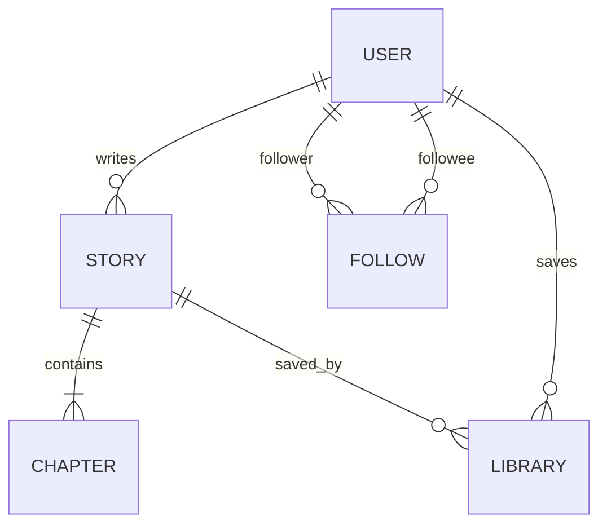
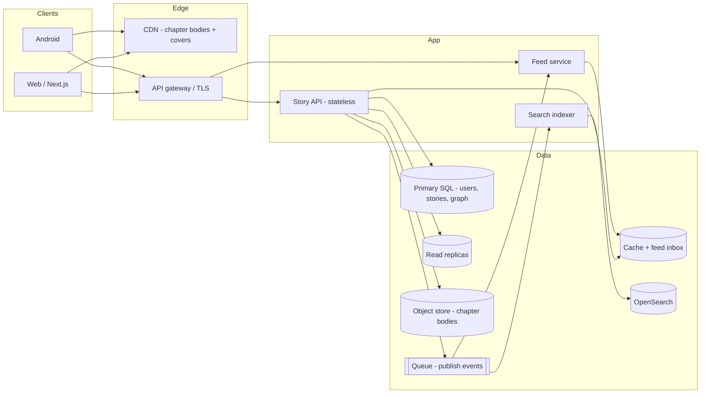
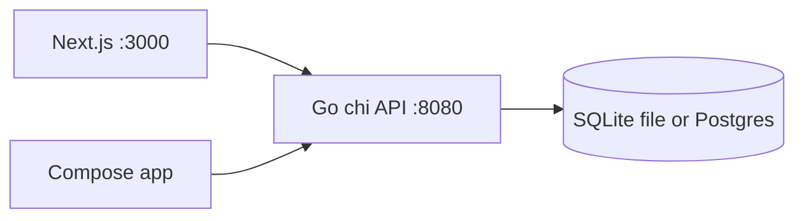
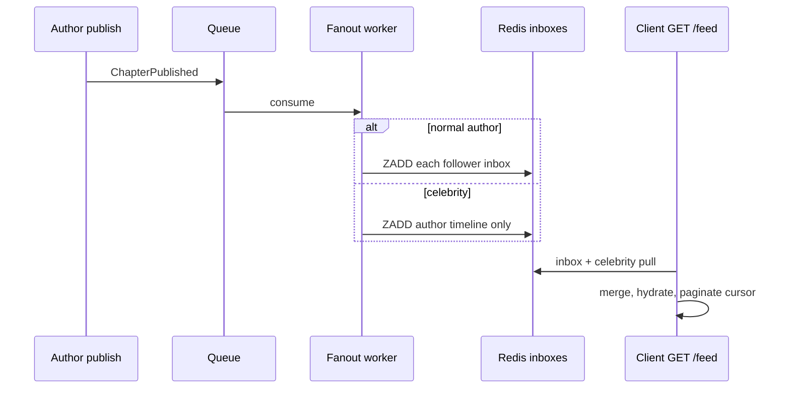

# Inkwell — Hello Interview–style system design

This document is the design you would walk through on a whiteboard for **“Design Wattpad / a serialized storytelling platform.”** It describes the *target* architecture at product scale, then maps it back to what this MVP actually ships (Go API + Postgres/SQLite, Next.js, Kotlin/Compose).

Interview framing: **requirements → entities → API → estimates → high-level design → deep dives (feed, reads, writes, search) → bottlenecks and trade-offs.**

---

## 1. Requirements (~5 min)

### Functional (MVP + interview)

1. Authors **create stories** made of **ordered chapters**, and can draft vs publish.
2. Anyone can **browse** published stories and **read** a chapter (prev/next).
3. Readers can **register/login**, **follow authors**, and **save stories to a library**.
4. Logged-in users see a **following feed** of recent work from people they follow.
5. Optional stretch (call out, do not boil the ocean): full-text **search**, comments, reads/votes, recommendations, offline downloads.

### Non-functional

| Concern | Target at “Wattpad-like” scale | MVP honesty |
| --- | --- | --- |
| Read latency | p99 < 200ms for cached chapter body | Single-node DB, fine for demo |
| Availability | Reads survive author-write spikes | One API process |
| Consistency | Publish is the consistency boundary; drafts are author-private | Same |
| Durability | Chapters never silently lost | SQLite/Postgres fsync |
| Freshness of feed | Seconds to a minute OK | Immediate SQL join |

### Clarifications I would ask

- Is the feed **chrono** or ranked? (Start chrono; ranking is a later ML service.)
- Are chapter **edits** after publish allowed? (Yes, but treat publish as an event that invalidates caches.)
- Guest reading without login? (**Yes** — this is a read-heavy consumer product.)
- Global vs regional authors? (Start one region; pin data by `user_id` later.)

---

## 2. Core entities (~2 min)

```
User        — id, username, email, password hash, display name, bio
Story       — id, author_id, title, synopsis, genre, status (draft|published), cover
Chapter     — id, story_id, title, body, position, published, timestamps
Follow      — (follower_id, followee_id)  // directed edge
Library     — (user_id, story_id)         // save-for-later
```

Out of scope for the first design pass, but named so the interviewer knows you see them: `ReadProgress`, `Comment`, `Vote`, `Tag`, `Report`.



---

## 3. API sketch (~5 min)

Public, JSON, JWT `Authorization: Bearer …` on mutating routes. Pagination: `limit` + `offset` in the MVP; **cursor** (`updated_at,id`) in production (offsets get expensive and inconsistent under writes).

| Method | Path | Auth | Notes |
| --- | --- | --- | --- |
| POST | `/api/auth/register` | no | `{username,email,password,displayName}` → `{token,user}` |
| POST | `/api/auth/login` | no | username or email |
| GET | `/api/me` | yes | profile |
| PATCH | `/api/me` | yes | display name, bio |
| GET | `/api/stories?q=&genre=&limit=&offset=` | optional | published catalog |
| GET | `/api/stories/{id}` | optional | metadata + chapter list (no bodies) |
| POST/PUT/DELETE | `/api/stories/{id}` | author | CRUD |
| GET | `/api/stories/{id}/chapters/{cid}` | optional | body + `prevId`/`nextId` |
| POST/PUT/DELETE | `/api/stories/{id}/chapters/{cid}` | author | |
| GET | `/api/feed` | yes | followed authors, newest stories |
| POST/DELETE | `/api/users/{id}/follow` | yes | |
| POST/DELETE | `/api/stories/{id}/library` | yes | |
| GET | `/api/me/library` | yes | |
| GET | `/api/users/{id}` | optional | public profile |

**Why chapter GET is separate from story GET:** list pages must stay small. A story with 200 chapters × 4k words would be a multi-megabyte JSON blob. Metadata in the index call, body on the read path — this is the same split you want when the body later lives in object storage.

---

## 4. Back-of-envelope estimates (~5 min)

Assume a mature product, not this repo:

| Quantity | Working number | How I got there |
| --- | --- | --- |
| MAU | 50M | “large consumer reading app” |
| DAU | 5M | 10% of MAU |
| Chapter reads / user / day | 10 | ~30 min session, 3 min/chapter |
| **Reads / day** | **50M** | 5e6 × 10 |
| Avg read QPS | ~580 | 50e6 / 86400 |
| Peak read QPS | **~3–5k** | 5–8× daily average, evening |
| New chapters / day | 50k | 1% of DAU publish something; most are tiny |
| Peak write QPS | tens–low hundreds | publishes + follows + library saves |
| Avg chapter body | 15 KB | ~2–3k words |
| Peak body egress | **~50–75 MB/s** | 5k QPS × 15 KB — **CDN, not origin** |
| Catalog size | 20M stories × 8 ch × 15 KB | **~2.4 TB text** plus metadata |
| Follow graph | 5M DAU × 40 follows | 200M edges; celebrity accounts dominate fanout |

**Takeaway you say out loud:** this product is **read-dominated and payload-heavy**. Writes are rare compared to reads, but a publish from a popular author is a **fanout burst**. Search and feed are the two features that will not survive “SELECT * FROM chapters JOIN follows”.

---

## 5. High-level architecture (~10–15 min)

Start simple, then layer the pieces the estimates force.



### Request flows (say this while drawing)

**Read a chapter.** Client hits `GET /stories/{id}/chapters/{cid}`. Gateway → API. Cache key `chapter:{id}:v{n}` in Redis; on miss, load metadata from SQL and body from object storage (or SQL in early stages). Return JSON; the client may also fetch a cover asset from CDN. **Prefetch `nextId`** so swipe/next is a cache hit.

**Publish a chapter.** Author PUT with `published=true`. API writes durable state (SQL + body), bumps `stories.updated_at`, enqueues `ChapterPublished{storyId, chapterId, authorId}`. Workers: (1) invalidate caches, (2) fan out to follower inboxes, (3) upsert search document.

**Follow.** Insert edge in `follows`. Optionally enqueue “backfill last N story IDs into follower inbox” so the feed is not empty.

### What this MVP runs instead



One binary, one database, JWT in memory/localStorage, seed data on empty DB. That is the correct *day-one* system. Everything above is what you add when QPS and payload size leave that box.

---

## 6. Data model (storage)

**MVP (this repo):** application-generated UUID strings, portable SQL (SQLite *or* Postgres). Tables: `users`, `stories`, `chapters`, `follows`, `library`. Indexes on `(status, updated_at)`, `author_id`, `(story_id, position)`.

**Production evolution:**

| Data | Store | Why |
| --- | --- | --- |
| Users, follows, library, story metadata | Sharded SQL (Postgres) | Relational integrity, authorizations |
| Chapter **bodies** | Object storage, key `stories/{id}/chapters/{cid}.txt` | Large, immutable-ish blobs; SQL stays skinny |
| Feed inbox | Redis ZSET or Cassandra `feed:{userId}` → `{score, storyId}` | Fanout-on-write needs cheap append + range |
| Session / hot chapter | Redis | Chapter bodies are textbook cache-aside |
| Search docs | OpenSearch | Prefix/title first, then body analyzer |

Do **not** put 15 KB bodies in the row you scan for a home feed. Metadata and body have different access patterns.

---

## 7. Deep dives

### 7.1 Following feed

**Naive (what the MVP does):**

```sql
SELECT stories.* FROM stories
JOIN follows ON follows.followee_id = stories.author_id
WHERE follows.follower_id = ? AND stories.status = 'published'
ORDER BY stories.updated_at DESC LIMIT 20;
```

This is correct and fine for hundreds of follows. It dies when (a) a user follows 2,000 people, (b) you have to merge “latest chapter” not “latest story row”, (c) celebrities publish.

**Fanout-on-write (Twitter-classic):** on publish, for each follower, `ZADD feed:{follower} score storyOrChapterId`. Read path is `ZREVRANGE` + hydrate. Great for normal authors.

**Celebrity / “hot author” problem:** an author with 8M followers cannot synchronously write 8M inbox entries. Hybrid:

- Authors below threshold T (e.g. 10k followers): **push**.
- Above T: **pull** — store on an author timeline `ZSET author:{id}`; at read time, merge the viewer’s inbox with the celebrity timelines they follow.



**Ranking (optional later):** candidate generation (inbox + pull) → light ranker (recency, unfinished stories) → heavy ranker. Keep the API cursor stable (`score,id`) so page 2 does not reshuffle.

MVP feed is **chrono SQL**. That is the right interview starting point; hybrid fanout is the deep dive.

### 7.2 Reads (the actual business)

Reading is not “hit Postgres.” At peak you are serving the same 50 hot chapters to tens of thousands of people.

1. **CDN / edge cache** for bodies if you ever serve them as HTML or signed blobs. Even with JSON, put a cache in front of the API (`Cache-Control` on published chapters).
2. **Application cache** keyed by chapter id + version. Edits increment version so you do not purge by prefix.
3. **Read replicas** for metadata list endpoints (`GET /stories`) so author publishes do not stall the catalog.
4. **Prefetch next chapter** from the client — cheap, huge perceived latency win.
5. **Hot-key protection:** a viral chapter needs request coalescing (singleflight) so 5k concurrent misses do not stampede SQL.

Hot vs cold: 1% of stories will take most of the traffic. Cache hit ratio should be excellent if you size Redis for a few GB of hot bodies.

### 7.3 Writes

Two very different writes:

| Write | Volume | Hard part |
| --- | --- | --- |
| Draft autosave | Burst per author, not global | Debounce; last-write-wins on `chapter_id` |
| Publish | Rare, globally important | Atomic flag + event + cache invalidation + fanout |
| Follow / library | Medium | Unique pair; idempotent; cache the counts |

Publish transaction (SQL): update chapter, bump story `updated_at`, commit, *then* emit the event. If you emit before commit you will fan out a chapter that rolled back.

Do not fan out inside the request thread. The author’s save must return in tens of milliseconds; 50k Redis ZADDs belong on a worker with retries.

### 7.4 Search (optional — say this even if you skip building it)

MVP has `LIKE` on title/synopsis — demo only.

Production: async indexer from the same publish queue. Document = `{storyId, title, synopsis, author, genre, firstChapterText?}`. Query: prefix on title for typeahead, BM25 on synopsis, filter `status=published`. Do **not** wait for search to be consistent with publish; a few seconds lag is fine. Do not run `LIKE '%foo%'` on 2 TB of bodies.

---

## 8. Bottlenecks, failures, trade-offs

**Bottlenecks, in the order they will appear:**

1. **Chapter origin bandwidth** — solved by cache/CDN, not more API boxes.
2. **Catalog queries without covering indexes** — `(status, updated_at DESC)` is mandatory.
3. **Feed fanout for popular authors** — hybrid push/pull; never synchronous.
4. **Celebrity follow graph** — store follower lists in a wide-row store or sharded SQL; never `SELECT follower_id FROM follows WHERE followee_id = celebrity` in the publish request.
5. **Search cluster** as a second source of truth — treat it as derived data.

**Trade-offs I would defend:**

| Choice | Instead of | Why |
| --- | --- | --- |
| SQL source of truth for metadata | Cassandra-first | Authorship, drafts, and chapter order are relational; you will regret a KV here on day one |
| Bodies eventually in object storage | Forever in Postgres TOAST | Postgres can hold them to ~low TB; ops pain and vacuum come first |
| Fanout-on-write + celebrity pull | Pure pull (query all followees) | Pull is simpler and is what the MVP does; it does not scale past a few hundred followees × QPS |
| JWT in localStorage (MVP) | HttpOnly cookies | Mobile + SPA share one API; cookies are better for web XSS; call this out as a demo shortcut |
| Chrono feed | ML ranking | Ranking needs labels (reads, dwell). Ship chrono, log events, rank later |
| Offset pagination (MVP) | Cursors | Offsets are fine under 10k rows; cursors are what you write on the board |

**What we explicitly did not design:** payments, ads, abuse/spam, DMCA, real-time comments, or an AI writing assistant. Those are different systems (and some are product landmines). Notifications can ride the same publish queue later (`Notif:{follower}`).

---

## 9. Mapping back to this repository

| Interview box | Inkwell MVP |
| --- | --- |
| Clients | `web/` Next.js App Router, `android/` Kotlin + Compose |
| API | `api/` Go (`chi`), JWT, CORS |
| DB | SQLite by default; Postgres via `DATABASE_URL` / Compose |
| Feed | SQL join, newest published stories from followees |
| Search | `?q=` `LIKE` on title/synopsis/author |
| Cache / CDN / queue | Not built — documented above |
| Auth hardening | Dev JWT secret, localStorage; not cookie+CSRF+refresh rotation |

If an interviewer asks “what would you build next?”, the honest order is: **(1) move chapter bodies behind a cache, (2) cursor pagination, (3) async publish events, (4) hybrid feed, (5) real search.** Not a recommendation model, and not a rewrite.
